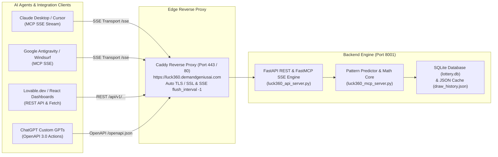

# 🎰 Luck360 Lottery Pattern Predictor — MCP & REST API Integration Runbook
### Production Developer Guide, Remote SSE Configurations & AI Client Manual (2026–2027)

**Live Production Domain:** `https://luck360.demandgeniusai.com`  
**MCP SSE Stream:** `https://luck360.demandgeniusai.com/sse`  
**OpenAPI 3.0 Specification:** `https://luck360.demandgeniusai.com/openapi.json`  
**Interactive Swagger UI:** [https://luck360.demandgeniusai.com/docs](https://luck360.demandgeniusai.com/docs)  
**System Health Check:** `https://luck360.demandgeniusai.com/health`  
**Web App Dashboard:** `https://luck360.demandgeniusai.com/`  

---

## 📌 Table of Contents
1. [Overview & Architecture Topology](#1-overview--architecture-topology)
2. [Integrating with AI Desktop Clients & IDEs (MCP Protocol)](#2-integrating-with-ai-desktop-clients--ides-mcp-protocol)
   - [Claude Desktop](#claude-desktop)
   - [Cursor IDE](#cursor-ide)
   - [Google Antigravity / Gemini CLI](#google-antigravity--gemini-cli)
   - [Windsurf & Continue.dev](#windsurf--continuedev)
3. [Integrating with AI Web Builders (Lovable.dev, v0, Bolt.new)](#3-integrating-with-ai-web-builders-lovabledev-v0-boltnew)
4. [Custom GPTs & OpenAI Actions Integration](#4-custom-gpts--openai-actions-integration)
5. [Frontend & Full-Stack Integration (React, Next.js, Node.js, Plain JS)](#5-frontend--full-stack-integration)
6. [Backend SDK Integration (Python & cURL)](#6-backend-sdk-integration-python--curl)
7. [Full Reference of FastMCP Tools & REST Endpoints](#7-full-reference-of-fastmcp-tools--rest-endpoints)
8. [Troubleshooting & Operational Management](#8-troubleshooting--operational-management)

---

## 1. Overview & Architecture Topology

Luck360 is an enterprise lottery analytics and constrained pattern prediction engine designed for Kerala State Lotteries, Nagaland Dear Lotteries, and Sikkim State Lotteries. It evaluates 12 mathematical transformation rules (H1–H5, P1–P3, Row 41, Row 60), tracks draw gaps/frequency, and generates multi-slot predictive forecasts.



---

## 2. Integrating with AI Desktop Clients & IDEs (MCP Protocol)

Luck360 exposes standard **Model Context Protocol (MCP)** endpoints over **Server-Sent Events (SSE)**.

### Claude Desktop
Edit your `claude_desktop_config.json`:
- **Windows:** `%APPDATA%\Claude\claude_desktop_config.json`
- **macOS:** `~/Library/Application Support/Claude/claude_desktop_config.json`

```json
{
  "mcpServers": {
    "luck360-lottery-predictor": {
      "url": "https://luck360.demandgeniusai.com/sse"
    }
  }
}
```
*Restart Claude Desktop. The hammer/tools icon will display all Luck360 prediction and analysis tools.*

---

### Cursor IDE
In Cursor, navigate to **Settings (`Ctrl+,`) → Features → MCP**, click **Add New MCP Server**:
- **Name:** `Luck360`
- **Type:** `SSE`
- **URL:** `https://luck360.demandgeniusai.com/sse`

Alternatively, add to your project's `.cursor/mcp.json`:
```json
{
  "mcpServers": {
    "Luck360": {
      "url": "https://luck360.demandgeniusai.com/sse"
    }
  }
}
```

---

### Google Antigravity / Gemini CLI
Add to `mcp_config.json` in your Antigravity workspace or `~/.gemini/mcp_config.json`:
```json
{
  "mcpServers": {
    "luck360": {
      "url": "https://luck360.demandgeniusai.com/sse"
    }
  }
}
```

---

### Windsurf & Continue.dev
In `~/.continue/config.json`:
```json
{
  "experimental": {
    "modelContextProtocolServers": [
      {
        "transport": {
          "type": "sse",
          "url": "https://luck360.demandgeniusai.com/sse"
        }
      }
    ]
  }
}
```

---

## 3. Integrating with AI Web Builders (Lovable.dev, v0, Bolt.new)

In **Lovable.dev**, **Bolt.new**, or **v0.dev**, create a real-time lottery intelligence portal in seconds using the OpenAPI schema:

1. In your Lovable project prompt, paste:
   > *"Connect to the Luck360 Lottery Analytics API using the OpenAPI specification at `https://luck360.demandgeniusai.com/openapi.json`. Build an interactive dashboard that displays the latest winning tickets, 3-day projection matrix across Nagaland and Kerala draws, top arrested targets with confidence metrics, and a pattern frequency heat chart."*

2. Lovable will auto-bind React components to:
   - `GET /api/v1/draws`
   - `GET /api/v1/patterns/arrest`
   - `GET /api/v1/patterns/predict`
   - `GET /api/v1/patterns/frequencies`
   - `GET /api/v1/audit`

---

## 4. Custom GPTs & OpenAI Actions Integration

1. Go to **ChatGPT → Explore GPTs → Create a GPT**.
2. Under the **Configure** tab:
   - **Name:** `Luck360 Lottery Pattern Analyst`
   - **Instructions:** *"You are an elite mathematical lottery analyst. Use the connected Luck360 Actions to retrieve live draw history, backtested pattern proofs, and constrained target projections for upcoming state draws."*
3. Click **Add Action**.
4. In the **Import from URL** input box, enter:  
   `https://luck360.demandgeniusai.com/openapi.json`
5. Click **Import**. All 8 endpoints are imported automatically.
6. Authentication: Set to **None** (Public read access is pre-enabled with open CORS).

---

## 5. Frontend & Full-Stack Integration

### JavaScript / TypeScript (Fetch Example)
```javascript
// Fetch latest arrested high-confidence pattern targets
async function getTopArrestTargets() {
  const response = await fetch('https://luck360.demandgeniusai.com/api/v1/patterns/arrest');
  const data = await response.json();
  console.log("Top Targets:", data.arrested_top_targets);
  return data.arrested_top_targets;
}

// Fetch 3-day projection schedule
async function getThreeDayPredictions() {
  const response = await fetch('https://luck360.demandgeniusai.com/api/v1/patterns/predict');
  const data = await response.json();
  console.log("Predictions:", data.schedule_predictions);
  return data.schedule_predictions;
}
```

---

## 6. Backend SDK Integration (Python & cURL)

### Python (Requests)
```python
import requests

BASE_URL = "https://luck360.demandgeniusai.com"

# 1. Health check
health = requests.get(f"{BASE_URL}/health").json()
print("System Status:", health["status"])

# 2. Get 3-day mathematical projections
predictions = requests.get(f"{BASE_URL}/api/v1/patterns/predict").json()
print(f"Base Tail: {predictions['starting_base_tail']}")

for slot in predictions["schedule_predictions"][:3]:
    print(f"[{slot['date']} {slot['time']}] {slot['lottery']} -> Recommended: {slot['top_targets']}")
```

### cURL
```bash
# Get top arrested targets
curl -s "https://luck360.demandgeniusai.com/api/v1/patterns/arrest"

# Calculate custom tail transformation patterns
curl -s "https://luck360.demandgeniusai.com/api/v1/patterns/calculate/221?ticket=76C18221"

# Trigger live result refresh
curl -X POST "https://luck360.demandgeniusai.com/api/v1/fetch-live"
```

---

## 7. Full Reference of FastMCP Tools & REST Endpoints

### FastMCP Tools (AI Agent Functions)

| Tool Name | Parameters | Description |
| :--- | :--- | :--- |
| `get_draw_records` | `limit: int = 50, include_patterns: bool = true` | Retrieves historical draw results, ticket numbers, tails, and pattern values. |
| `add_draw_record` | `date, time, company, lottery, ticket` | Registers a newly declared official draw outcome, updates DB, and updates frequency. |
| `analyze_pattern_matches` | None | Backtests all historical draw transitions and detects Straight Matches and Box Matches. |
| `arrest_patterns` | None | Runs constrained target filtration algorithm on latest draw to isolate high-confidence targets. |
| `predict_next_days` | `starting_tail: Optional[str]` | Generates multi-draw projection matrix across upcoming draw slots (Nagaland, Kerala, Sikkim). |
| `get_pattern_frequencies` | None | Returns pattern hit statistics, hit rate percentages, gap age, and heat status (HOT/COLD). |
| `get_audit_report` | None | Full audit report showing WHEN, WHAT, FOR WHAT PATTERN, and HOW (step-by-step arithmetic). |
| `fetch_latest_live_results`| None | Triggers official portal web scraping and database synchronization. |
| `calculate_custom_tail_patterns` | `tail: str, ticket_str: str = ""` | Computes all 12 mathematical formulas for any user-provided 3-digit tail number. |

---

### REST API Endpoints

| Method | Endpoint | Description |
| :--- | :--- | :--- |
| `GET` | `/` | Live Luck360 luxury interactive analytics web dashboard. |
| `GET` | `/health` | Server and MCP health status. |
| `GET` | `/docs` | Interactive Swagger UI documentation. |
| `GET` | `/openapi.json` | OpenAPI 3.0 schema definition for AI builders and Custom GPTs. |
| `GET` | `/sse` | FastMCP Server-Sent Events stream for AI clients. |
| `POST` | `/messages` | FastMCP client JSON-RPC message endpoint. |
| `GET` | `/api/v1/draws` | Query historical draws with optional limit and pattern calculations. |
| `POST` | `/api/v1/draws` | Insert new official draw result. |
| `GET` | `/api/v1/patterns/matches` | Backtest historical sequential transitions. |
| `GET` | `/api/v1/patterns/arrest` | Get top arrested targets and confidence rankings. |
| `GET` | `/api/v1/patterns/predict` | 3-day projection matrix. |
| `GET` | `/api/v1/patterns/frequencies`| Pattern hit frequencies and heat statuses. |
| `GET` | `/api/v1/patterns/calculate/{tail}` | Calculate patterns for custom tail number. |
| `GET` | `/api/v1/audit` | Comprehensive audit trail report. |
| `POST` | `/api/v1/fetch-live` | Trigger live scraping of official lottery portals. |

---

## 8. Troubleshooting & Operational Management

### Launching the Backend Service
Run the one-click batch launcher:
```bat
c:\Users\DemandGeniusAI\lottery\start_luck360_mcp.bat
```
Or directly from PowerShell / CMD:
```powershell
& "C:\Program Files\Python311\python.exe" "c:\Users\DemandGeniusAI\lottery\luck360_api_server.py"
```

### Checking Reverse Proxy & SSL
The edge gateway is managed by Caddy on ports 80 and 443 with automated Let's Encrypt TLS:
```powershell
& "c:\Users\DemandGeniusAI\mcp\caddy\caddy.exe" reload --config "c:\Users\DemandGeniusAI\mcp\Caddyfile"
```

### Verifying Endpoints
```powershell
# Health Check
curl.exe -I https://luck360.demandgeniusai.com/health

# MCP SSE Stream
curl.exe -N https://luck360.demandgeniusai.com/sse
```
